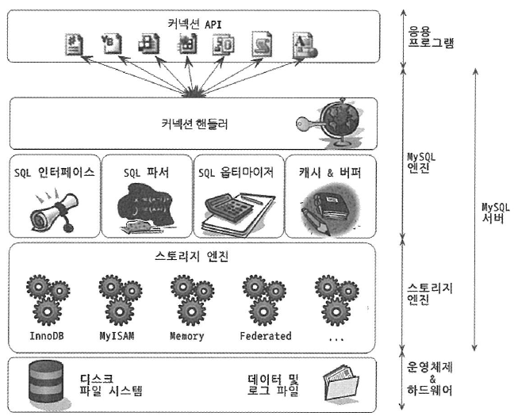
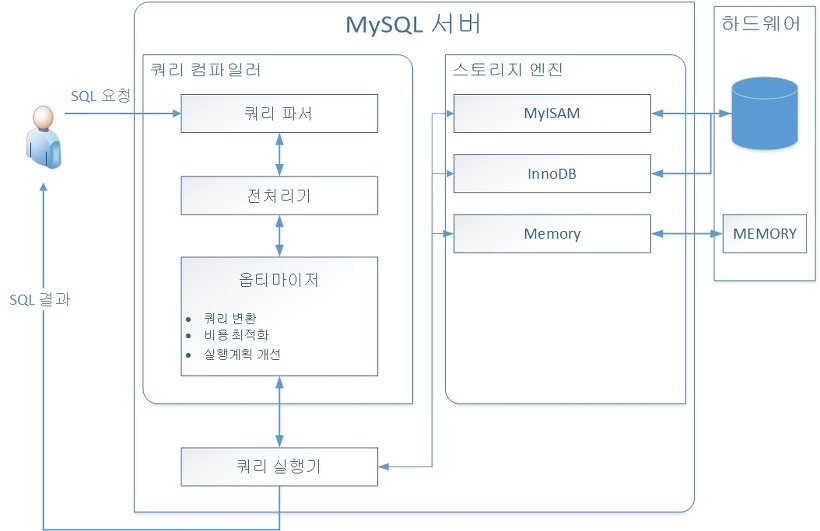

## 1. MySQL 아키텍처 전체 구조도

1️⃣ **MySQL 엔진**
* Connection Handler: 클라이언트로부터 접속 및 쿼리 요청을 처리한다
* SQL Parser: 사용자로부터 받은 Query를 트리 구조로 변환시킨다. 기본적인 문법 오류는 여기서 잡힌다
* 전처리기: SQL Parser로부터 받은 쿼리 트리를 해석해서 전처리한다. Parser에서 안 잡힌 문법 오류가 여기서 잡힌다.
* SQL Optimizer: 전처리까지 거친 쿼리 트리를 최적화시킨다

2️⃣ **스토리지 엔진**

MySQL 엔진에서 쿼리를 처리하는 과정에서 필요한 데이터를 디스크 스토리지로부터 읽어오는 역할, 혹은 데이터를 디스크 스토리지에 저장하는 
역할을 수행한다.

주로 스토리지 엔진으로 두 가지가 많이 언급된다.
* InnoDB
* MyISAM

3️⃣ **Handler API**

> 🚨 **앞에서 말한 Connection Handler와는 다르다는 것을 인지하길 바란다.**

Handler API는 **MySQL의 쿼리 처리기에서 디스크 스토리지로부터 데이터를 읽어올 필요가 있거나, 혹은 써야할 때 스토리지 엔진 간의 상호작용을 위해 사용해야하는 API이다.**

이 때 이러한 요청을 **핸들러 요청** 이라고 부른다.

즉, Handler API는 MySQL 엔진과 Storage engine 사이의 상호작용을 담당하는 역할이라고 생각하면 되겠다.

## 2. MySQL 쓰레딩 구조

1️⃣ **Foreground Thread (Client thread)**

* 클라이언트가 요청하는 쿼리 요청을 처리하는 스레드이다.
* 따라서 클라이언트 커넥션만큼 최소한의 개수가 보장되어야한다.
* 클라이언트와 커넥션이 끊어질 경우 해당 스레드는 thread cache로 돌아간다. 그러나, **Thread Cache의 정해진 갯수 정책을 넘어서면 해당 스레드는 저장이 되는게 아니라 폐기된다.** 쓰레드를 유지하는 것도 비용이기 때문이다.
* Foreground thread는 데이터를 데이터 버퍼 혹은 캐시에서 가져오는 역할을 수행한다. 데이터 버퍼 혹은 캐시에 데이터가 없다면 **디스크에 접근해서 가져오는 역할도 수행한다.**

👉 InnoDB의 경우 쓰기 요청에 관해서 데이터 접근을 Background Thread에 맡긴다. 쓰기 지연을 지원하기 위해서이다.

👉 그러나 MyISAM의 경우 쓰기 요청을 Foreground Thread가 하도록한다. 그로 인해 쓰기 지연이 지원되지 않기 때문에 client가 쓰기 요청이 끝나기를 기다려야하는 부작용이 생긴다.

2️⃣ **Background Thread**

* InnoDB를 사용시 데이터 쓰기 요청에 대해서는 Background thread에 위임한다고 앞에서 언급한 바 있다.
* Background thread에는 읽기 쓰레드, 쓰기 쓰레드가 구분이 되어있는데, InnoDB 특성 상 쓰기 쓰레드를 Background Thread에 많이 할당해야한다.
* InnoDB는 데이터 쓰기 요청을 Background thread에 위임하기 때문에 client는 쓰기 결과를 기다릴 필요가 없어진다.

## 3. MySQL의 메모리 할당 및 사용 구조

1️⃣ **Global memory space**

* MySQL의 모든 스레드에 공유가 되는 영역이다.

2️⃣ **Local(Session) memory space**

* Client Thread (Foreground thread)가 쿼리를 처리하기 위해서 사용되는 공간이다.
* 클라이언트 별로 독립되어 할당되는 공간이다.
* 소트 버퍼, 조인 버퍼의 경우 쿼리를 실행하는 순간 할당되었다가 쿼리가 종료되면 할당 해제가 되기도한다.
* 즉, Local memory space는 유동적으로 할당이 되는 영역이다.

## 4. 쿼리 실행 구조

1️⃣ **Query parser**

* 사용자 요청으로 들어온 쿼리 문장을 **토큰 단위**로 분리하여 트리 형태의 구조로 만들어내는 작업을 담당한다.
* 쿼리 문장의 기본 문법 오류는 여기서 잡힌다

2️⃣ **전처리기**

* Query parser를 통해서 들어온 토큰 트리를 분석하여 **쿼리 문장에 구조적인 문제점이 있는지 확인한다.**
* 실제 존재하지 않거나, 혹은 접근 권한이 존재하지 않는 개체의 토큰은 여기서 걸러져서 오류를 뱉어준다

3️⃣ **Optimizer**

* 사용자 요청으로 들어온 쿼리 문장을 low cost로 처리할 수 있도록 최적화하는 역할을 수행한다

4️⃣ **Execution engine**

* Optimizer를 통해 최적화된 쿼리 요청을 실행하는 역할을 수행한다
* Handler API를 이용해서 스토리지 엔진과의 상호작용 과정을 통해서 실질적인 쿼리 실행을 담당한다

5️⃣ **Thread Pool**

* 사용자 요청 쿼리를 처리하는데 있어서 스레드 개수를 제한시켜서 서버의 자원 소모를 줄이는 역할을 수행한다
> ⭐️ **MySQL 엔진의 쿼리 실행 과정에서 많은 스레드가 유지되면 Thread의 Context switching이 자주 일어나게 됩니다. 따라서 적당한 개수의 스레드를 유지해주는 것이 처리 속도가 빠릅니다.**

* 보통은 스레드 그룹의 개수를 MySQL Server의 CPU 개수와 맞춰준다. 그렇게 해야 CPU Processor friendly 하기 때문에 쿼리 처리 성능이 향상된다.

6️⃣ **트랜잭션 지원 메타데이터**

* MySQL 5.7 이후 버전부터 메타데이터를 **파일 기반으로 관리하는 것이 아닌, 테이블로 관리하게 되었다.**
* 이를 통해서 메타데이터 또한 트랜잭션으로 관리하는게 가능해졌다.
* 따라서, 메타데이터 또한 ACID가 보장되기 때문에 메타데이터가 깨지는 현상은 줄어들었다
