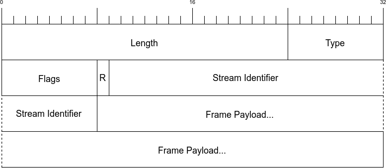
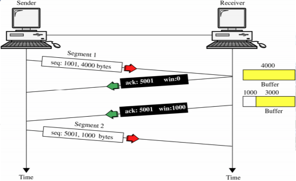

## 1. HTTP/2의 특성
* 바이너리 프로토콜: H2의 프레이밍 계층은 H1처럼 텍스트 기반이 아닌, **바이너리로 인코딩되어 날아간다**. 따라서 기계 입장에서는 해석이 쉽지만, 사람이 읽기는 힘들다.
* 헤더 압축: H2부터는 공통된 부분에 대해서는 **허프만 인코딩 방식 기반의 HPACK을 통해 헤더가 압축된다.** 따라서 비대한 헤더로 인한 오버헤드가 줄어들었다.
* 다중화: 하나의 HTTP Stream 안에서 요청, 응답이 뒤섞여서 날아간다. 또한 H2는 Frame Layer, Data Layer가 분리되서 날아가기 때문에 더 강한 다중화가 지원된다.
* 암호화: 날아가는 데이터 대부분은 암호화되서 날아간다.

## 2. 프레이밍 계층에 대해서 더 깊게!
기존의 H1 요청 예시를 들겠다.

~~~http request
GET / HTTP/1.1
Host: www.example.com
Accept: text/html,application/xhtml+xml,application/xml;q=0.9...
User-Agent: Mozilla/5.0 (Macintosh; Intel Mac OS X 10_11_4)
Accept-Encoding: gzip,deflate,sdch
Accept-Language: en-US,en;q=0.8
Cookie: pfy_cbc_lb=p-browse-w; customerZipCode=999912|N; ltc=%20; ...
~~~

위의 요청을 해석하기 위해선 아래의 상태 머신이 고려되어야할 것이다.

~~~
loop
    while ( !CRLF )
    read bytes
    end while
    
    if first line:
        parse line as the Request-line
    else if line is empty:
        break out of the loop
    else if line starts with non-whitespace:
        parse the header line into a key/value pair
    else if line starts with space:
        add the continuation header to the previous header
    end if
end loop
~~~

위의 방식은 아래의 문제를 야기할 것이다.
* 한번에 하나의 요청/응답의 전송만이 이뤄진다. 모든 전송이 끝날 때까지 파싱해야한다.
* 파싱에 얼마나 많은 메모리가 소모될지 예측이 어렵다. 라인마다 얼마나 데이터가 적혀있는지 H1의 헤더만 보고는 알 길이 없기 때문이다.

그래서 H2는 위의 문제들을 해결하기 위해서, **Framing Layer**를 도입하기로 결정하였다.

H2 부터는 텍스트로 헤더를 작성하는 것이 아닌, 위의 구조를 가지는 프레임을 생성해서 **파싱에 들어가는 오버헤드를 극단적으로 줄였다.**

따라서 H2 frame을 해석하기 위한 파싱 로직은 아래와 같이 복잡도가 낮아질 것이다.

~~~
loop
    Read 9 bytes off the wire
    Length = the first three bytes
    Read the payload based on the length
    Take the appropriate action based on the frame type
end loop
~~~

게다가 프레임은 정해진 형식의 헤더이기 때문에 **전송되는 헤더에도 일관성이 발생한다.**

그리고 H2부터는 Frame, Data 레이어가 구분이 되며, 또한 하나의 스트림에 요청/응답이 뒤섞일 수 있기 때문에 **HOL 블로킹 현상이 극복된다.**

## 3. 스트림

HTTP/2 규격에서는 스트림을 아래와 같이 정의한다.

> 👉 **HTTP/2 연결이 이루어진 클라이언트와 서버 사이에서 독립적이고 양방향으로 교환되는 일련의 프레임 모음**

여기서 짚고 넘어가야할 점은, H2는 프레이밍 덕분에 다수의 요청과 응답이 서로를 차단하지 않고 (HOL 블로킹이 일어나지 않고) 뒤섞여 배치될 수 있다는 것이다.

## 4. 청크 분할이 필요없어졌다

기존의 HTTP/1.1 까지는 헤더에 데이터 길이가 명시되어있지 않기 때문에 데이터의 크기를 요구할 때는 청크 분할이 필요했다.

그러나, HTTP/2 부터는 프레임에 데이터의 길이를 명시할 수 있기 때문에 더 이상 청크분할이 필요없어졌다. 즉, HTTP/2 부터는 **청크 분할은 안티패턴이다.**

## 5. ⭐️ 흐름 제어 ⭐️

HTTP/2에 들어서 **Client또한 응용 계층에서의 흐름 제어에 참여하게 되었다.** 즉, HTTP/2 부터는 클라이언트가 전송 속도를 조절하는 기능을 제공할 수 있게되었다.

이게 어떠한 방식으로 구현이 되었는지 알아보기 이전에 TCP 에서는 어떻게 흐름제어를 수행했는지 알아보자.

위의 그림처럼, TCP에서는 Receiver 측이 Sender 측에 자신의 rwnd 정보를 전달하여서 client가 흐름제어에 참여하였다.

HTTP/2또한 비슷한 맥락이다. **WINDOWS_UPDATE** 라는 필드를 서버와 클라이언트가 서로 교환하는 방식으로 **client가 응용계층에서의 흐름 제어에 참여하게 되었다.**

## 6. 우선순위

HTTP/2 부터는 멀티플렉싱(다중화)가 지원된다고 말한 바 있다. 이로 인해서 HTTP/1.1 환경에서 잘 제공하지 않던 **파이프라이닝** 또한 잘 지원하게 되었는데, 
이로 인해서 추가로 득을 보게 된것은, **요청/응답에 우선순위를 부여할 수 있다는 것이다.**

HTTP/2 부터는 프레이밍 기반으로 데이터를 주고받기 때문에, HTTP/2의 PRIORITY frame을 이용하면 데이터에 우선순위를 부여하여 데이터의 주고받기가 가능해진다.

## 7. Server Push

HTTP/2 부터는 클라이언트가 요청하지 않은 것에 대해서도 Server 측이 알아서 데이터를 푸시하는 것이 가능해졌다.

이로 인해서 얻을 수 있는 장점은 아래와 같을것이다.

* 웹페이지에서 큰 용량을 차지하는 데이터를 미리 push하여 클라이언트에 캐싱시킨다. 이로 인해 웹페이지의 렌더링 속도를 개선할 수 있다.

HTTP/2에서는 이를 **PUSH_PROMISE** 라는 프레임을 이용해서 구현을 하는데, 강력한 기능인 만큼 강한 책임또한 존재한다.

* 전송할 개체는 캐싱이 가능해야한다. 캐싱이 안되면 서버 푸시를 하는 의미가 없다
* **PUSH_PROMISE** 프레임이 Data 프레임보다 client 측에 먼저 도착해야한다. 물론 h2는 이를 자연스럽게 처리할 수 있는 기능이 있으나, 앵간하면 이걸 보장하는게 좋다.

## ⭐️ 8. 헤더 압축 ⭐️

아마도 HTTP/2의 아주 핵심이 되는 기능이지 않을까싶다.

HTTP/2 부터는 공통된 부분에 대해서는 헤더 압축을 지원하기 때문에 **비대한 헤더에 대한 반복 전송 문제**를 효율적으로 대처할 수 있다.

HTTP/2는 이러한 헤더 압축을 **허프만 인코딩 알고리즘 기반의 HPACK**을 통해 지원한다. ~~**(물론 설명하려면 너무 머리 아프기 때문에 생략)**~~